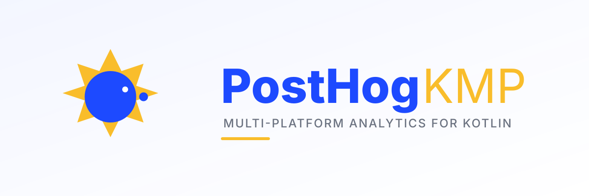

<p align="center">
  
</p>

<p align="center">
  
  
  
  
  
</p>

# PostHog KMP

Kotlin Multiplatform SDK for [PostHog](https://posthog.com) — type-safe analytics, feature flags, and event capture for every platform Kotlin runs on.

## Features

- **Type-safe Result monad** — `PostHogResult<T>` with `map`, `flatMap`, `recover` — no exceptions leak to callers
- **Value class IDs** — `DistinctId`, `ApiKey`, `FeatureFlagKey`, `GroupType`, `GroupKey` prevent mixups at compile time
- **Properties DSL** — Build event properties with a clean Kotlin DSL instead of raw JSON
- **Event capture with automatic batching** — Queue events in memory, flush at threshold or on interval
- **User identification** — Associate distinct IDs with user properties via `identify` and `alias`
- **Group analytics** — Associate users with companies, projects, or any custom group type
- **Feature flags with caching** — Fetch flags from `/decide`, cache in memory, observe via `StateFlow`
- **Multivariate flags** — Boolean, string, and typed JSON payloads with `getTypedPayload<T>()`
- **Super properties** — Register properties that are merged into every subsequent event
- **Opt in/out** — Disable all capture with a single call, GDPR-friendly
- **15 platform targets** — Android, iOS, macOS, tvOS, watchOS, JVM, Linux, Windows, and WasmJs
- **Manual wiring** — No runtime DI container required

## Setup

Add the dependencies you need to your `build.gradle.kts`:

```kotlin
// Version catalog (gradle/libs.versions.toml)
[versions]
posthog-kmp = "0.1.1"

[libraries]
posthog-core = { module = "io.github.androidpoet:posthog-core", version.ref = "posthog-kmp" }
posthog-client = { module = "io.github.androidpoet:posthog-client", version.ref = "posthog-kmp" }
posthog-feature-flags = { module = "io.github.androidpoet:posthog-feature-flags", version.ref = "posthog-kmp" }
```

```kotlin
// build.gradle.kts
kotlin {
    sourceSets {
        commonMain.dependencies {
            implementation(libs.posthog.client)        // includes posthog-core
            implementation(libs.posthog.feature.flags) // optional
        }
    }
}
```

## Usage

### Create a Client

```kotlin
// Direct instantiation
val client = PostHog.create("phc_your_project_api_key") {
    host = "https://us.i.posthog.com"  // or "https://eu.i.posthog.com"
    flushAt = 20
    flushIntervalMs = 30_000L
    logging = true
    preloadFeatureFlags = true
}

val client = createPostHogClient("phc_your_project_api_key", config)
val flags = createFeatureFlagsClient(client)
```

### Capture Events

```kotlin
// Simple event
client.capture("page_viewed")

// With properties DSL
client.capture("button_clicked") {
    "screen" to "home"
    "button_id" to "cta_main"
    "count" to 3
    "is_premium" to true
}
```

### Identify Users

```kotlin
client.identify(
    distinctId = "user_123",
    userProperties = buildJsonObject {
        put("name", "Jane Doe")
        put("email", "jane@example.com")
        put("plan", "pro")
    },
)
```

### Feature Flags

```kotlin
val flags = createFeatureFlagsClient(client)

// Load flags from server
flags.loadFlags(distinctId = "user_123")

// Boolean check
if (flags.isFeatureEnabled("new-dashboard")) {
    showNewDashboard()
}

// Multivariate string value
val variant = flags.getStringFlag("onboarding-flow", defaultValue = "control")

// Typed JSON payload
@Serializable
data class DiscountConfig(val percent: Int, val code: String)

val discount = flags.getTypedPayload<DiscountConfig>("summer-sale")

// Observe flag changes reactively
flags.flagsFlow.collect { allFlags ->
    val enabled = allFlags.filter { it.value.isEnabled }
    println("Enabled flags: ${enabled.keys}")
}
```

### Group Analytics

```kotlin
client.group(
    groupType = "company",
    groupKey = "company_abc",
    groupProperties = buildJsonObject {
        put("name", "Acme Corp")
        put("plan", "enterprise")
        put("employee_count", 250)
    },
)
```

### Batch Flush

```kotlin
// Flush all queued events immediately
client.flush()

// Reset client (new distinct ID, clear queue and super properties)
client.reset()

// Clean up when done
client.close()
```

## Architecture

```
┌─────────────────────────────────────────────────────────┐
│                        Your App                          │
├──────────────┬──────────────────┬────────────────────────┤
│  posthog-    │    posthog-      │     posthog-           │
│  feature-    │    client        │     core               │
│  flags       │                  │                        │
│              │  PostHogClient   │  PostHogResult         │
│  /decide     │  HttpTransport   │  Properties DSL        │
│  Cache       │  Event Queue     │  Value IDs             │
│  StateFlow   │  Batch Flush     │  Models                │
│  Typed       │  Super Props     │  Serialization         │
│  Payloads    │  Factory API     │  Error Types           │
│              ├──────────────────┤                        │
│              │  Ktor Engines    │                        │
│              │  OkHttp · Darwin │                        │
│              │  CIO · Js        │                        │
└──────────────┴──────────────────┴────────────────────────┘
```

## Modules

| Module | Artifact | Description |
|--------|----------|-------------|
| **posthog-core** | `io.github.androidpoet:posthog-core` | Result monad, error types, value class IDs, event/flag models |
| **posthog-client** | `io.github.androidpoet:posthog-client` | HTTP transport, event capture, batching, identify, groups |
| **posthog-feature-flags** | `io.github.androidpoet:posthog-feature-flags` | Feature flag evaluation, caching, StateFlow observation, typed payloads |

## Targets

| Platform | Target | Ktor Engine |
|----------|--------|-------------|
| Android | `androidTarget()` | OkHttp |
| JVM | `jvm()` | OkHttp |
| iOS | `iosX64()` `iosArm64()` `iosSimulatorArm64()` | Darwin |
| macOS | `macosX64()` `macosArm64()` | Darwin |
| tvOS | `tvosX64()` `tvosArm64()` `tvosSimulatorArm64()` | Darwin |
| watchOS | `watchosX64()` `watchosArm64()` `watchosSimulatorArm64()` | Darwin |
| Linux | `linuxX64()` | CIO |
| Windows | `mingwX64()` | CIO |
| Web | `wasmJs()` | Js |

## Why posthog-kmp?

| | posthog-kmp | posthog-android (official) |
|--|--|--|
| **Platforms** | 15 KMP targets | Android only |
| **Error handling** | `PostHogResult<T>` monad | Thrown exceptions |
| **Type safety** | Value class IDs | String IDs |
| **Feature flags** | Cached + `StateFlow` | Cached |
| **DI** | Manual wiring | Manual |
| **Properties** | Kotlin DSL | Map builders |
| **Dependencies** | 3 core | Platform-specific |
| **Codebase** | ~2K LOC | ~15K LOC |

## Tech Stack

| Layer | Library |
|-------|---------|
| Language | [Kotlin 2.1.10](https://kotlinlang.org/) |
| Networking | [Ktor 3.1.1](https://ktor.io/) |
| Serialization | [kotlinx.serialization 1.8.0](https://github.com/Kotlin/kotlinx.serialization) |
| Coroutines | [kotlinx.coroutines 1.10.1](https://github.com/Kotlin/kotlinx.coroutines) |
| Date/Time | [kotlinx-datetime 0.6.2](https://github.com/Kotlin/kotlinx-datetime) |
| Publishing | [vanniktech maven-publish 0.30.0](https://github.com/vanniktech/gradle-maven-publish-plugin) |

## Build

```bash
# Compile all targets
./gradlew compileKotlinJvm

# Run tests
./gradlew jvmTest

# Full build (all platforms)
./gradlew build --no-configuration-cache

# Publish to Maven Central (CI only)
./gradlew publishAllPublicationsToMavenCentral --no-configuration-cache
```

## License

```
MIT License

Copyright (c) 2026 Ranbir Singh

Permission is hereby granted, free of charge, to any person obtaining a copy
of this software and associated documentation files (the "Software"), to deal
in the Software without restriction, including without limitation the rights
to use, copy, modify, merge, publish, distribute, sublicense, and/or sell
copies of the Software, and to permit persons to whom the Software is
furnished to do so, subject to the following conditions:

The above copyright notice and this permission notice shall be included in all
copies or substantial portions of the Software.

THE SOFTWARE IS PROVIDED "AS IS", WITHOUT WARRANTY OF ANY KIND, EXPRESS OR
IMPLIED, INCLUDING BUT NOT LIMITED TO THE WARRANTIES OF MERCHANTABILITY,
FITNESS FOR A PARTICULAR PURPOSE AND NONINFRINGEMENT. IN NO EVENT SHALL THE
AUTHORS OR COPYRIGHT HOLDERS BE LIABLE FOR ANY CLAIM, DAMAGES OR OTHER
LIABILITY, WHETHER IN AN ACTION OF CONTRACT, TORT OR OTHERWISE, ARISING FROM,
OUT OF OR IN CONNECTION WITH THE SOFTWARE OR THE USE OR OTHER DEALINGS IN THE
SOFTWARE.
```
